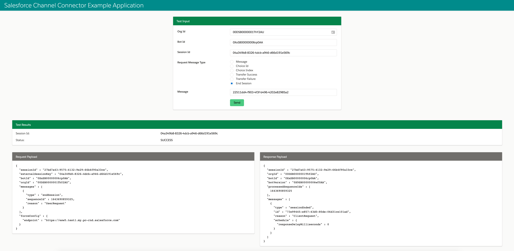

# Channel Connector Starter Example

This Example application to built using Channel Connector Starter to demonstrate the usage.

## Pre Requisites

Before you can run this example app, you need to

* [Create a Connected App to Access Einstein Bot APIs](http://bot-api-sdk.herokuapp.com/einstein-bot-api/guide/prerequisites.html#step-1:-create-a-connected-app)
* [Configure an Einstein Bot](http://bot-api-sdk.herokuapp.com/einstein-bot-api/guide/prerequisites.html#step-2:-configure-an-einstein-bot)
* Update  [application.properties](example/src/main/resources/application.properties) according to
  your setup.

## Running this Example

* Install einstein-bot-channel-connector-java-starter.
    * Go to <channel-connector-java-starter> dir `cd ../channel-connector-starter`
    * Run `mvn clean install`

* Run spring boot application using maven

    * Go to channel-connector-example dir. `cd ../channel-connector-example`

    * Run ` mvn spring-boot:run`

## Testing Chatbot Client using Tester Controller

[EinsteinBotController](src/main/java/com/salesforce/einsteinbot/connector/example/EinsteinBotController.java)
is included to quickly test various chatbot request and responses.

You can run it by hitting http://localhost:8080/bot/tester and provide appropriate input parameters
to test.



Here is brief description of input parameters

| Name                 | Description                              | Required                                 |
| -------------------- | ---------------------------------------- | ---------------------------------------- |
| orgId                | Salesfore Org Id                         | Yes                                      |
| botId                | Einstein Bot Id                          | Yes                                      |
| sessionId            | Unique Session Id for Bot.               | No. You must pass it continue existing session, otherwise new bot session will be initiated. You copy sessionId from Test Result |
| Request Message Type | Type of message. Depending on message type enter appropriate input for message field. | Yes.                                     |
| message              | Request message to user. It can be text for Text Message or can be Choice Id or Choice Index for Choice Message. | No. Not required for Transfer Success or Transfer Failure or End Session message types. |

**Note**: The tester UI is not authenticated and it is provided only to easily test during
development. Please remove it before deploying to production.

You can also run health check by hitting http://localhost:8080/bot/health

## Metrics

To view metrics : http://localhost:8080/actuator/metrics

### Publishing metrics

This example
includes [NewRelicMetricsExportAutoConfiguration](src/main/java/com/salesforce/einsteinbot/connector/example/NewRelicMetricsExportAutoConfiguration.java)
to setup publishing metrics to New Relic. To enable add these properties to application.

```properties
management.metrics.export.newrelic.api-key=${NEW_RELIC_API_KEY}
management.metrics.export.newrelic.enabled=true
```

